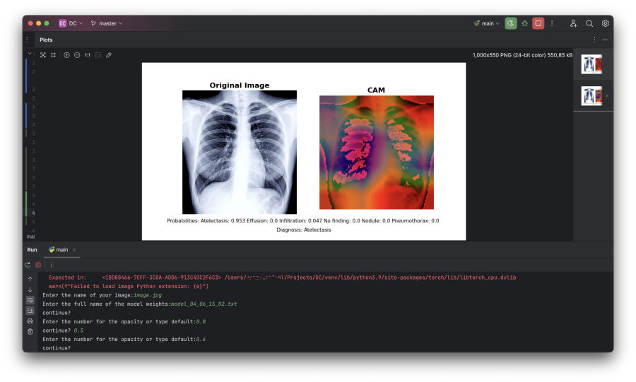

# JBG040 | Data Challenge 1
This repository contains the code for the TU/e course JBG040 Data Challenge 1.
Please read this document carefully as it has been filled out with important information.
Note: The "Code structure" section has been modified compared to the original README.md.

## Code structure
The code is structured into multiple files, based on their functionality. 
Each `.py` file contains a different part of the code. 

- To download the data: run the `image_dataset.py` file. The script will create a directory `/dc1/data/` and download the training and test data with corresponding labels to this directory. 
    - You will only have to run this script once usually, at the beginning of your project.

- To run the whole training/evaluation pipeline: run `/dc1/train.py`. This script is prepared to do the followings:
    - Load your train and test data (Make sure its downloaded beforehand!)
    - Initializes the neural network chosen in `model.py`. The structure of the network is defined in the `net.py` file for the template model and in the `resnet.py` for ResNet.
    - Initialize loss functions and optimizers. If you want to change the loss function/optimizer, do it here.
    - Define number of training epochs and batch size.
    - Check and enable GPU acceleration for training (if you have CUDA or Apple Silicon enabled device).
    - Train the neural network and perform evaluation on test set at the end of each epoch.
    - Provide plots about the training losses both during training in the command line and as a png (saved in the `/dc1/artifacts/` subdirectory).
    - Save your trained model's weights in the `/dc1/model_weights/` subdirectory so that you can reload them later.
    - Save your experiment description, which can be defined at the beginning of the file, in `/dc1/results/<model architecture>/<experiment type>/`.

- To calculate the accuracy, f1 score, precision and recall of the trained model: run `/dc1/use_model.py`. Make sure to specify the following:
    - `model_file_name`: the name of the .txt file with model weights.

- To use the model for the classification of an image: run `main.py`. Make sure to specify the following:
    - `modelPath`: the path to the .txt file with model weights.
    - `image_path`: the path to the image you want to classify - the image should be uploaded in `/input/`. An example image is included.

Note that the Neural Network structure is defined in the `net.py` file, so if you want to modify the network itself, you can do so in that script.
The loss functions and optimizers are all defined in `/dc1/train.py`.

## Environment setup instructions
We strongly recommend using a virtual environment (either [Anaconda](https://www.anaconda.com/) or [venv](https://docs.python.org/3/library/venv.html)) to run this Python program.

Our codebase has been developed for **Python version 3.9**. After creating an environment with this version of Python, in case you're using an IDE such as Pycharm, configure a Python interpreter (based on your environment)
and _choose the repository root as your working directory_. This is important in a sense that it determines the relative modules.

Once the environment is set to go, install all the requirements listed in `requirements.txt`. This can be done by `pip install -r requirements.txt`.

> 💡 If you're using a virtual environment, make sure to do the pip installations in terminal from your environment.

## How to train and run the model
> 🚨 Please note that unlike the template model, `main.py` is not responsible for training the model. Follow the below instructions to initiate the training process.

### 1. Fetching data
In order to start the training process, the raw data must be grabbed from the Internet.
To do this, you can run the file `image_dataset.py` from the project root.

### 2. Preprocessing
Run the Python file `dc1/cripts/outliers.py` in order to pre-process the data.
This will create the corresponding subdirectories `preprocessed/remove_outliers` under `dc1/data` containing four new `.npy` datasets.

Make sure the preprocessed data is placed in the correct location (as described above) as this is necessary to run the training later on.

### 3. Training
Run `dc1/train.py` in order to initiate training the model weights. The training will be done in ten epochs.
Upon a successful completion of training, a text file will be created in `dc1/model_weights` which includes the weights and biases for the neural network.

### 4. Using the model and predicting diseases
Once the training is done, run main.py (placed in the root directory). You can place your input image in the `input/` directory.

The script will ask you for the name of your input image. Pass the file name (including its extension) to the program. For instance `image.jpg`.

Then you'll be asked to provide the name of the model weights file obtained from training the model. This file is place in `dc1/model_weights`.

Pass the file name (including the extension but without directories etc.). For example: `model_04_06_15_02.txt`.

By passing these parameters the model will the pass the image forward into the neural network and provide you with predictions for each class + a CAM image specifying the emphasis of model on different areas of the image.

